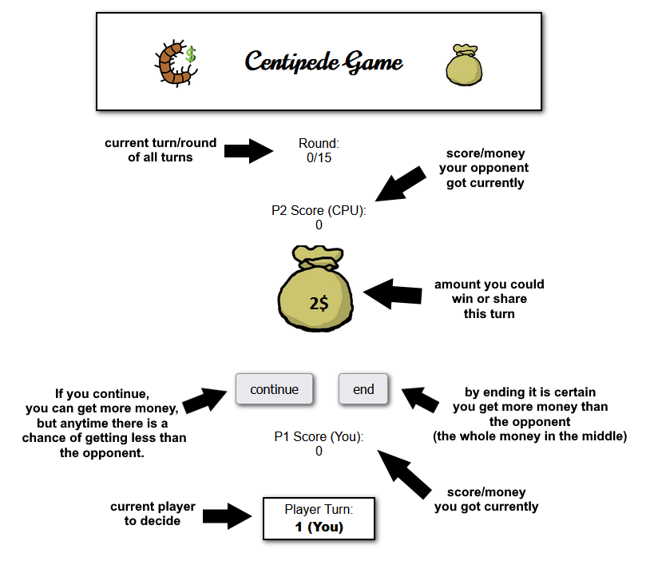
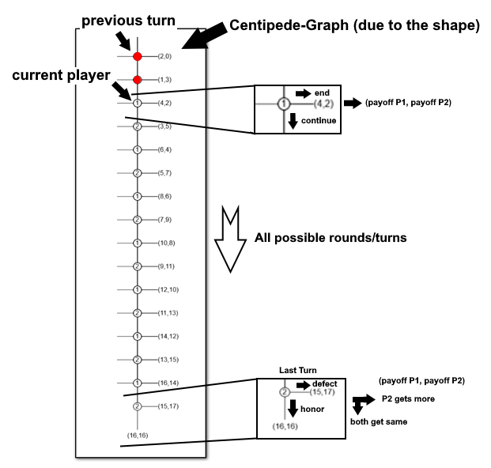

# CentipedeGameVisualization

This is a Visualization of the Centipede Game in Game Theory made by M-Gentes in cooperation with Professor Dr. Oscar Lin.
There are two players switching turns and by
continuing they increase the payoff but also the chance the other player quits for getting a better
payoff. The name "Centipede" comes from the graph you can draw for the possible payoffs of each player.

## Learning Objectives of the Centipede Game

- explain what an extensive-form game is;
- explain what a subgame perfect Nash equilibrium (SPNE) is.
- explain the Nash equilibrium and subgame perfect Nash equilibria of The Centipede Game.
- use backwards induction to find SPNE of extensive-form games.

## Introduction

The (N-turn) Centipede Game is an extensive form game with two players. In the first turn of the game, Player 1 and Player 2 are presented with a sum of money $. Player 1 can either choose to take, and get more money than Player 2, or pass. If Player 1 takes the money the game is over. If Player 1 passes, the sum of money is altered and now Player 2 can decide to take or pass on it. If Player 2 takes, they get more money than Player 1 and the game ends. If Player 2 passes, again the sum of money is altered, and now the second turn of the game starts. This process repeats until one of the players decides to take the money, or until the game runs out of N turns. If each player passes for every turn in the game, both players leave with an equal amount of money.

## Important concept:

Subgame perfect Nash equilibrium is a refinement to the concept of a Nash equilibrium (see: [The prisoner's dilemma game](https://github.com/hbala1-source/AU-PrisonersDilemma)).  First, any subgame perfect Nash equilibrium of a game is also a Nash equilibrium of that game. Second, subgame perfect Nash equilibria captures the idea of “perfect recall” where players “remember” their past action choices as they progress through the game and use their “memories” to play “better” as the game progresses. That is, in a SPNE, players act like they would act in hindsight.

## Further readings:

- 1. more complex game: [pirate game](https://en.wikipedia.org/wiki/Pirate_game)
    - Deciding to share money amongst a group of people with different vote hierarchy and the distribution planner with highest hierarchy can be thrown overboard
    - Pirates must not be social and want at least some of the money

## Images:

- Centipede base game description
    - 

- Centipede graph description
    - 

- Centipede process diagramm
    - 

- Centipede code diagramm
    - 
